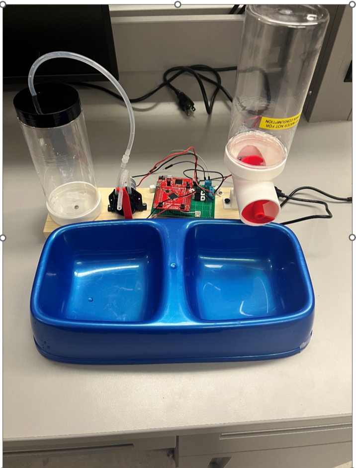

Embedded Systems for Pet Feeder

# Introduction
The goal of this project was to create an automated pet feeder capable of maintaining a water dish at a set level, freshening the water when the pet is nearby, and dispensing predetermined amounts of food at scheduled times. The feeder utilizes capacitive sensing to measure the water level, a PIR motion sensor to detect when the pet is present, a peristaltic pump to deliver water, a DC gear motor to run an auger to dispense food, and a microcontroller to control the components and timing.

# Hardware

